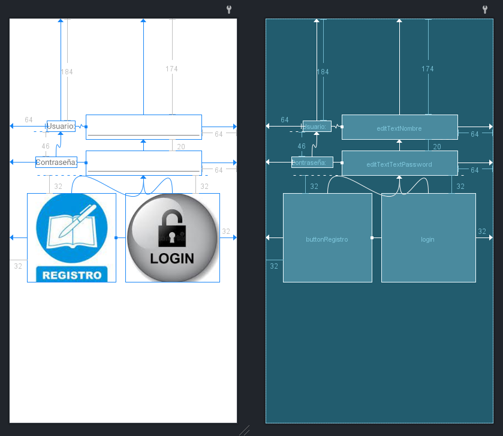
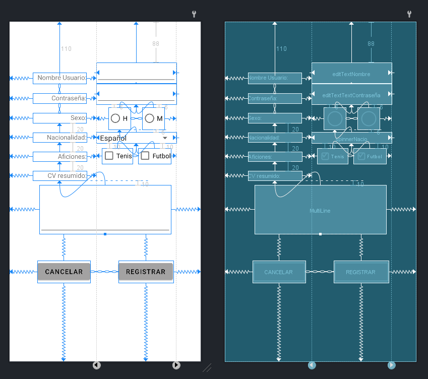
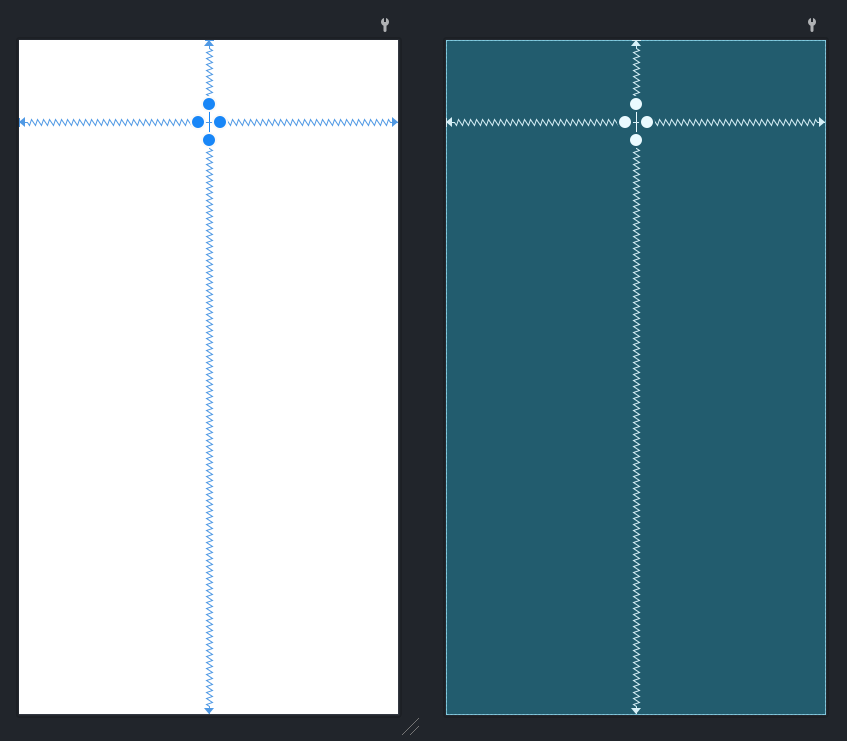

# Ejercicio 8 - Task 08 (GUI Login y Registro)

### Llevado a cabo por:

GRUPO 06

- Javier Alcantarilla Ballesteros (Developer 01)
- Daniel Izquierdo Bonilla (Developer 02)
- Alejandro Elías Vicente (QA Tester)
- Rodrigo Sánchez Gómez (Documentalista)

## Introducción

Dadas las pautas a seguir para la realización de este ejercicio, acometemos la programación backend y frontend del mismo.

## Enunciado y pautas a seguir

- Se ejecutará el programa trasladando al usuario a una interfaz de Login: Se establece
como logueo válido que el usuario y la password sean iguales, pero no vacías. Una vez
se haya logueado con éxito, aparecerá una interfaz sencilla que da le dará la bienvenida
personalizada.

- Habrá una opción dentro de la interfaz de loguin que permita acceder a la interfaz de
registro.

- La GUI de registro debe contener obligatoriamente, al menos, lossiguientes controles: 
TextView, EditText, Button, ImageButton, RadioButton, Checkbox y Spinner.

- Debe haber algún mecanismo para volver a la interfaz principal de login (por ejemplo,
mediante un botón cancelar).

- Deben realizarse pruebas funcionales sobre todas las interfaces y controlar el mayor
número de errores posibles.

A continuación de las pautas provistas, se acompaña de unos ejemplos visuales para la interfaz gráfica.

## Índice de los puntos explicativos a tratar

1. Interfaz visual de logueo.
2. Backend (parte lógica de la <i>activity</i>) del logueo.
3. Interfaz visual del registro.
4. Backend (parte lógica de la <i>activity</i>) del registro.
5. Interfaz de la <i>activity</i> final.
6. Backend de esta última.

## Interfaz visual del logueo



El código de la interfaz de logueo es el siguiente:

```xml
<?xml version="1.0" encoding="utf-8"?>
<androidx.constraintlayout.widget.ConstraintLayout xmlns:android="http://schemas.android.com/apk/res/android"
    xmlns:app="http://schemas.android.com/apk/res-auto"
    xmlns:tools="http://schemas.android.com/tools"
    android:layout_width="match_parent"
    android:layout_height="match_parent"
    tools:context=".Login">

    <TextView
        android:id="@+id/user"
        android:layout_width="wrap_content"
        android:layout_height="wrap_content"
        android:layout_marginStart="64dp"
        android:layout_marginTop="184dp"
        android:layout_marginEnd="16dp"
        android:text="Usuario:"
        app:layout_constraintEnd_toStartOf="@+id/editTextNombre"
        app:layout_constraintStart_toStartOf="parent"
        app:layout_constraintTop_toTopOf="parent" />

    <TextView
        android:id="@+id/pass"
        android:layout_width="wrap_content"
        android:layout_height="wrap_content"
        android:layout_marginStart="48dp"
        android:layout_marginTop="46dp"
        android:layout_marginEnd="16dp"
        android:text="Contraseña:"
        app:layout_constraintEnd_toStartOf="@+id/editTextTextPassword"
        app:layout_constraintStart_toStartOf="parent"
        app:layout_constraintTop_toBottomOf="@+id/user" />

    <EditText
        android:id="@+id/editTextNombre"
        android:layout_width="wrap_content"
        android:layout_height="wrap_content"
        android:layout_marginTop="174dp"
        android:layout_marginEnd="64dp"
        android:ems="10"
        android:inputType="textPersonName"
        app:layout_constraintEnd_toEndOf="parent"
        app:layout_constraintTop_toTopOf="parent" />

    <EditText
        android:id="@+id/editTextTextPassword"
        android:layout_width="wrap_content"
        android:layout_height="wrap_content"
        android:layout_marginTop="20dp"
        android:layout_marginEnd="64dp"
        android:ems="10"
        android:inputType="textPassword"
        app:layout_constraintEnd_toEndOf="parent"
        app:layout_constraintTop_toBottomOf="@+id/editTextNombre" />

    <ImageButton
        android:id="@+id/buttonRegistro"
        android:layout_width="161dp"
        android:layout_height="161dp"
        android:layout_marginStart="32dp"
        android:layout_marginTop="32dp"
        app:layout_constraintStart_toStartOf="parent"
        app:layout_constraintTop_toBottomOf="@+id/editTextTextPassword"
        tools:src="@drawable/registro" />

    <ImageButton
        android:id="@+id/login"
        android:layout_width="0dp"
        android:layout_height="161dp"
        android:layout_marginStart="16dp"
        android:layout_marginTop="32dp"
        android:layout_marginEnd="32dp"
        app:layout_constraintEnd_toEndOf="parent"
        app:layout_constraintStart_toEndOf="@+id/buttonRegistro"
        app:layout_constraintTop_toBottomOf="@+id/editTextTextPassword"
        tools:src="@drawable/login" />
</androidx.constraintlayout.widget.ConstraintLayout>
```

- Elementos a destacar:
    - Se emplea ```ConstraintLayout``` para posicionar y ajustar los elementos dentro de la pantalla.
    - Los elementos principales incluyen dos campos de texto (```EditText```) para ingresar el nombre de usuario y la contraseña, dos etiquetas de texto (```TextView```) para indicar el propósito de cada campo de texto, y dos botones de imagen (```ImageButton```) para iniciar sesión y registrarse
    - Las imágenes asociadas a ImageButton, van vinculadas con el atributo ```tools:src```.
    - Todas las <i>constraint</i> asociadas a este <i>layout</i> han sido correctamente establecidas siguiendo medidas de diseño apropiadas para el ejercicio.

## Backend (parte lógica de la <i>activity</i>) del logueo.

El código del backend de esta actividad es el siguiente:

```kotlin
package com.example.task08grupalloginregistro

import android.content.Intent
import android.os.Bundle
import android.widget.Toast
import androidx.appcompat.app.AlertDialog
import androidx.appcompat.app.AppCompatActivity
import com.example.task08grupalloginregistro.databinding.ActivityLoginBinding

class Login : AppCompatActivity() {
    lateinit var binding: ActivityLoginBinding
    var users = HashMap<String, String>()
    override fun onCreate(savedInstanceState: Bundle?) {
        super.onCreate(savedInstanceState)
        binding = ActivityLoginBinding.inflate(layoutInflater)
        setContentView(binding.root)

        botonLogin()
        botonRegistro()

    }

    fun botonLogin(){
        binding.login.setImageResource(R.drawable.login)
        binding.login.setOnClickListener {
            if(areAllFieldsEmpty())
                alertaAllFieldsEmpty()
            else{
                obtenerUser()
                if (users.isNotEmpty())
                    checkUser()
                else
                    alertaUsuario()
            }
        }
    }

    private fun areAllFieldsEmpty(): Boolean {
        return binding.editTextNombre.text.toString().isEmpty() || binding.editTextTextPassword.text.toString().isEmpty()
    }

    fun botonRegistro(){
        binding.buttonRegistro.setImageResource(R.drawable.registro)
        binding.buttonRegistro.setOnClickListener {
            val intent= Intent(this, Registro::class.java)
            startActivity(intent)
        }
    }

    fun checkUser(){
        if (users.containsKey(binding.editTextNombre.text.toString()))
            if (isValidUserToLogin()) {
                val intent = Intent(this, Home::class.java)
                intent.putExtra("USUARIO", binding.editTextNombre.text.toString())
                startActivity(intent)
            } else
                alertaPass()
        else
            alertaUsuario()
    }

    private fun isValidUserToLogin(): Boolean {
        return users.keys.first() == binding.editTextNombre.text.toString() && users[binding.editTextNombre.text.toString()].equals(binding.editTextTextPassword.text.toString()) && binding.editTextNombre.text.toString() == binding.editTextTextPassword.text.toString()
    }

    fun alertaUsuario(){
        val builder = AlertDialog.Builder(this)
        builder.setTitle("Error")
        builder.setMessage("El usuario introducido no existe.")
        builder.setPositiveButton("Aceptar") { dialog, which ->
            Toast.makeText(applicationContext,
                "Aceptar", Toast.LENGTH_SHORT).show()
        }
        builder.show()
    }

    private fun alertaAllFieldsEmpty() {
        val builder = AlertDialog.Builder(this)
        builder.setTitle("Error")
        builder.setMessage("El usuario y la contraseña no pueden estar vacíos.")
        builder.setPositiveButton("Aceptar") { dialog, which ->
            Toast.makeText(applicationContext,
                "Aceptar", Toast.LENGTH_SHORT).show()
        }
        builder.show()
    }

    fun obtenerUser(){
        val user = intent.getStringExtra("USER")
        val pass = intent.getStringExtra("PASS")

        if (user != null && pass != null)
            users[user] = pass

    }

    fun alertaPass(){
        val builder = AlertDialog.Builder(this)
        builder.setTitle("Error")
        builder.setMessage("La contraseña no es correcta para el usuario \"${binding.editTextNombre.text}\" o bien no cumple los requerimientos del ejercicio.")
        builder.setPositiveButton("Aceptar") { dialog, which ->
            Toast.makeText(applicationContext,
                "Aceptar", Toast.LENGTH_SHORT).show()
        }
        builder.show()
    }
}
```

- Elementos a destacar:
    - La variable users consta de un mapa de tipo ```HashMap<String, String>``` que almacena los usuarios y contraseñas.
    - El método ```botonLogin()``` es el encargado de <i>handlear</i> el evento de clic del botón de inicio de sesión, verificando que los campos de usuario y contraseña no estén vacíos, buscando el usuario en el ```HashMap``` de usuarios y mostrando una alerta si no existe o si la contraseña es incorrecta.
    - El método ```botonRegistro()``` es el encargado de <i>handlear</i> el evento de clic del botón de registro, iniciando una nueva actividad llamada ```Registro```.
    - El método ```checkUser()``` es el encargado de verificar si el usuario existe en el ```HashMap``` de usuarios y si la contraseña es correcta, iniciando una nueva actividad llamada Home de ser así.
    - Los métodos ```alertaUsuario()```, ```alertaAllFieldsEmpty()``` y ```alertaPass()``` muestran alertas al usuario con mensajes específicos en caso de error.
    El método ```obtenerUser()``` obtiene los datos de usuario y contraseña pasados a través del <i>Intent</i>, es decir, desde la activity ```Registro``` y los agrega al ```HashMap``` de usuarios.

## Interfaz visual del registro



El código de la interfaz de registro es el siguiente:

```xml
<?xml version="1.0" encoding="utf-8"?>
<androidx.constraintlayout.widget.ConstraintLayout xmlns:android="http://schemas.android.com/apk/res/android"
    xmlns:app="http://schemas.android.com/apk/res-auto"
    xmlns:tools="http://schemas.android.com/tools"
    android:layout_width="match_parent"
    android:layout_height="match_parent"
    tools:context=".Registro">

    <TextView
        android:id="@+id/sexo"
        android:layout_width="115dp"
        android:layout_height="22dp"
        android:layout_marginTop="20dp"
        android:gravity="right"
        android:text="@string/sexo"
        app:layout_constraintEnd_toStartOf="@+id/guideline3"
        app:layout_constraintHorizontal_bias="0.7"
        app:layout_constraintStart_toStartOf="parent"
        app:layout_constraintTop_toBottomOf="@+id/pass" />

    <CheckBox
        android:id="@+id/checkBoxFutbol"
        android:layout_width="wrap_content"
        android:layout_height="33dp"
        android:layout_marginTop="10dp"
        android:text="@string/futbol"
        android:textSize="14sp"
        app:layout_constraintEnd_toStartOf="@+id/guideline4"
        app:layout_constraintStart_toEndOf="@+id/checkBoxTenis"
        app:layout_constraintTop_toBottomOf="@+id/spinnerNacio" />

    <EditText
        android:id="@+id/editTextTextContraseña"
        android:layout_width="0dp"
        android:layout_height="wrap_content"
        android:ems="10"
        android:inputType="textPersonName"
        app:layout_constraintEnd_toStartOf="@+id/guideline4"
        app:layout_constraintStart_toStartOf="@+id/guideline3"
        app:layout_constraintTop_toBottomOf="@+id/editTextNombre" />

    <TextView
        android:id="@+id/nombre"
        android:layout_width="115dp"
        android:layout_height="24dp"
        android:layout_marginTop="110dp"
        android:gravity="right"
        android:text="@string/nombre_usuario"
        android:textSize="14sp"
        app:layout_constraintBottom_toTopOf="@id/pass"
        app:layout_constraintEnd_toStartOf="@+id/guideline3"
        app:layout_constraintHorizontal_bias="0.7"
        app:layout_constraintStart_toStartOf="parent"
        app:layout_constraintTop_toTopOf="parent" />

    <TextView
        android:id="@+id/pass"
        android:layout_width="115dp"
        android:layout_height="22dp"
        android:layout_marginTop="20dp"
        android:gravity="right"
        android:text="@string/contra"
        android:textSize="14sp"
        app:layout_constraintBottom_toTopOf="@+id/sexo"
        app:layout_constraintEnd_toStartOf="@+id/guideline3"
        app:layout_constraintHorizontal_bias="0.7"
        app:layout_constraintStart_toStartOf="parent"
        app:layout_constraintTop_toBottomOf="@+id/nombre" />

    <EditText
        android:id="@+id/editTextNombre"
        android:layout_width="0dp"
        android:layout_height="wrap_content"
        android:layout_marginTop="88dp"
        android:ems="10"
        android:inputType="textPersonName"
        app:layout_constraintEnd_toStartOf="@+id/guideline4"
        app:layout_constraintHorizontal_bias="0.0"
        app:layout_constraintStart_toStartOf="@+id/guideline3"
        app:layout_constraintTop_toTopOf="parent" />

    <TextView
        android:id="@+id/aficiones"
        android:layout_width="116dp"
        android:layout_height="21dp"
        android:layout_marginTop="20dp"
        android:gravity="right"
        android:text="@string/aficiones"
        app:layout_constraintEnd_toStartOf="@+id/guideline3"
        app:layout_constraintHorizontal_bias="0.7"
        app:layout_constraintStart_toStartOf="parent"
        app:layout_constraintTop_toBottomOf="@+id/nacionalidad" />

    <TextView
        android:id="@+id/textViewCV"
        android:layout_width="116dp"
        android:layout_height="21dp"
        android:layout_marginTop="20dp"
        android:gravity="right"
        android:text="@string/cv_resumido"
        app:layout_constraintEnd_toStartOf="@+id/guideline3"
        app:layout_constraintHorizontal_bias="0.7"
        app:layout_constraintStart_toStartOf="parent"
        app:layout_constraintTop_toBottomOf="@+id/aficiones" />

    <TextView
        android:id="@+id/nacionalidad"
        android:layout_width="116dp"
        android:layout_height="21dp"
        android:layout_marginTop="20dp"
        android:gravity="right"
        android:text="@string/nacionalidad"
        app:layout_constraintEnd_toStartOf="@+id/guideline3"
        app:layout_constraintHorizontal_bias="0.7"
        app:layout_constraintStart_toStartOf="parent"
        app:layout_constraintTop_toBottomOf="@+id/sexo" />

    <CheckBox
        android:id="@+id/checkBoxTenis"
        android:layout_width="wrap_content"
        android:layout_height="33dp"
        android:layout_marginTop="10dp"
        android:text="Tenis"
        android:textSize="14sp"
        app:layout_constraintEnd_toStartOf="@+id/checkBoxFutbol"
        app:layout_constraintStart_toStartOf="@+id/guideline3"
        app:layout_constraintTop_toBottomOf="@+id/spinnerNacio" />

    <Spinner
        android:id="@+id/spinnerNacio"
        android:layout_width="0dp"
        android:layout_height="wrap_content"
        android:entries="@array/nacio"
        android:layout_marginTop="6dp"
        app:layout_constraintEnd_toStartOf="@+id/guideline4"
        app:layout_constraintStart_toStartOf="@+id/guideline3"
        app:layout_constraintTop_toBottomOf="@+id/radioH" />

    <EditText
        android:id="@+id/MultiLine"
        android:layout_width="283dp"
        android:layout_height="105dp"
        android:layout_marginTop="10dp"
        android:ems="10"
        android:gravity="start|top"
        android:inputType="textMultiLine"
        app:layout_constraintEnd_toEndOf="parent"
        app:layout_constraintStart_toStartOf="parent"
        app:layout_constraintTop_toBottomOf="@+id/textViewCV" />

    <Button
        android:id="@+id/cancelar"
        android:layout_width="wrap_content"
        android:layout_height="wrap_content"
        android:backgroundTint="#A3A2A2"
        android:text="@string/cancelar"
        android:textColor="@color/black"
        app:layout_constraintBottom_toBottomOf="parent"
        app:layout_constraintEnd_toStartOf="@+id/registrar"
        app:layout_constraintStart_toStartOf="parent"
        app:layout_constraintTop_toBottomOf="@+id/MultiLine"
        app:layout_constraintVertical_bias="0.25" />

    <Button
        android:id="@+id/registrar"
        android:layout_width="wrap_content"
        android:layout_height="wrap_content"
        android:backgroundTint="#A3A2A2"
        android:text="@string/registrar"
        android:textColor="@color/black"
        app:layout_constraintBottom_toBottomOf="parent"
        app:layout_constraintEnd_toEndOf="parent"
        app:layout_constraintStart_toEndOf="@+id/cancelar"
        app:layout_constraintTop_toBottomOf="@+id/MultiLine"
        app:layout_constraintVertical_bias="0.25" />

    <androidx.constraintlayout.widget.Guideline
        android:id="@+id/guideline3"
        android:layout_width="wrap_content"
        android:layout_height="wrap_content"
        android:orientation="vertical"
        app:layout_constraintGuide_begin="187dp" />

    <androidx.constraintlayout.widget.Guideline
        android:id="@+id/guideline4"
        android:layout_width="wrap_content"
        android:layout_height="wrap_content"
        android:orientation="vertical"
        app:layout_constraintGuide_end="53dp" />

    <RadioButton
        android:id="@+id/radioH"
        android:layout_width="wrap_content"
        android:layout_height="wrap_content"
        android:layout_marginTop="6dp"
        android:text="@string/h"
        android:textSize="14sp"
        app:layout_constraintEnd_toStartOf="@+id/radioM"
        app:layout_constraintStart_toStartOf="@+id/guideline3"
        app:layout_constraintTop_toBottomOf="@+id/editTextTextContraseña" />

    <RadioButton
        android:id="@+id/radioM"
        android:layout_width="wrap_content"
        android:layout_height="wrap_content"
        android:layout_marginTop="6dp"
        android:text="@string/m"
        android:textSize="14sp"
        app:layout_constraintEnd_toStartOf="@+id/guideline4"
        app:layout_constraintStart_toEndOf="@+id/radioH"
        app:layout_constraintTop_toBottomOf="@+id/editTextTextContraseña" />

</androidx.constraintlayout.widget.ConstraintLayout>
```

- Elementos a destacar:
    - Empleamos ```TextView``` y ```EditText``` para lo básico. Introducción de texto y clarificación para el usuario.
    - Implementamos ```RadioButtons``` para el sexo del usuario.
    - Para la nacionalidad, se emplea un ```Spinner``` con varios entries con el atributo ```android:entries```
    - En las aficiones, utilizamos ```CheckBoxes```.
    - Para el CV resumido, utilizamos un ```EditText``` con un área ampliada para la introducción de gran cantidad de texto.
    - Finalmente, los botones inferiores se tratan de ```RadioButtons```, que no llegan a diferenciarse demasiado de un ```Button``` normal y corriente, solo que las esquinas están más redondeadas y se catalogan de forma más moderna en la documentación de Android Studio.

## Backend (parte lógica de la <i>activity</i>) del registro.

El código del backend de esta actividad es el siguiente:

```kotlin
package com.example.task08grupalloginregistro

import android.content.Intent
import androidx.appcompat.app.AppCompatActivity
import android.os.Bundle
import android.widget.Toast
import androidx.appcompat.app.AlertDialog
import androidx.core.view.isEmpty
import com.example.task08grupalloginregistro.databinding.ActivityRegistroBinding

class Registro : AppCompatActivity() {
    lateinit var binding: ActivityRegistroBinding
    override fun onCreate(savedInstanceState: Bundle?) {
        super.onCreate(savedInstanceState)
        binding = ActivityRegistroBinding.inflate(layoutInflater)
        setContentView(binding.root)

        validarUsuario()
        botonVolver()
        botonesSexo()

    }

    fun validarUsuario(){
        binding.registrar.setOnClickListener {
            if (binding.editTextNombre.text.isEmpty() || binding.editTextTextContraseA.text.isEmpty())
                alertaRegistro()
            else if (!binding.radioH.isChecked && !binding.radioM.isChecked)
                alertaRegistro()
            else if (binding.spinnerNacio.isEmpty())
                alertaRegistro()
            else if (!binding.checkBoxFutbol.isChecked && !binding.checkBoxTenis.isChecked)
                alertaRegistro()
            else if (binding.MultiLine.text.isEmpty())
                alertaRegistro()
            else{
                val intent = Intent(this, Login::class.java)
                intent.putExtra("USER", binding.editTextNombre.text.toString())
                intent.putExtra("PASS", binding.editTextTextContraseA.text.toString())
                startActivity(intent)
            }
        }
    }

    fun botonVolver(){
        binding.cancelar.setOnClickListener {
            val intent = Intent(this, Login::class.java)
            startActivity(intent)
        }
    }

    fun alertaRegistro(){
        val builder = AlertDialog.Builder(this)
        builder.setTitle("Error")
        builder.setMessage("Tiene que introducir todos los datos necesarios.")
        builder.setPositiveButton("Aceptar") { dialog, which ->
            Toast.makeText(applicationContext,
                "Aceptar", Toast.LENGTH_SHORT).show()
        }
        builder.show()
    }

    fun botonesSexo(){
        binding.radioH.setOnClickListener {
            binding.radioM.isChecked = false
        }
        binding.radioM.setOnClickListener {
            binding.radioH.isChecked = false
        }
    }
}
```

- Elementos a destacar:
    - Validamos que los campos de "nombre" y "contraseña" no estén vacíos antes de permitir el registro.
    - Validamos que se haya seleccionado un género, deporte favorito y nacionalidad antes de permitir el registro.
    - Si todas las validaciones son exitosas, se inicia la actividad "Login" y se pasan los valores de "nombre" y "contraseña" como parámetros.
    - Damos la posibilidad al usuario de volver a la actividad anterior mediante un botón de "cancelar" que devuelve al usuario a la actividad "Login" sin registrarlo.
    - Mostramos un cuadro de diálogo con un mensaje de error si alguna de las validaciones falla.
    - A la hora de seleccionar el sexo, existe una funcionalidad de "botones de género" que permite seleccionar solo uno de los dos botones que se presentan.

## Interfaz visual de la pantalla ```home```



El código de la interfaz de registro es el siguiente:

```xml
<?xml version="1.0" encoding="utf-8"?>
<androidx.constraintlayout.widget.ConstraintLayout xmlns:android="http://schemas.android.com/apk/res/android"
    xmlns:app="http://schemas.android.com/apk/res-auto"
    xmlns:tools="http://schemas.android.com/tools"
    android:layout_width="match_parent"
    android:layout_height="match_parent"
    tools:context=".Home">

    <TextView
        android:id="@+id/textView"
        android:layout_width="wrap_content"
        android:layout_height="wrap_content"
        android:textColor="#171717"
        android:textSize="30sp"
        app:layout_constraintBottom_toBottomOf="parent"
        app:layout_constraintEnd_toEndOf="parent"
        app:layout_constraintStart_toStartOf="parent"
        app:layout_constraintTop_toTopOf="parent"
        app:layout_constraintVertical_bias="0.1" />
</androidx.constraintlayout.widget.ConstraintLayout>
```

- Elementos a destacar:
    - Simplemente establecemos un ```TextView```donde irá el saludo al usuario autenticado correctamente.

## Backend (parte lógica de la <i>activity</i>) del ```home```.

El código del backend de esta actividad es el siguiente:

```kotlin
package com.example.task08grupalloginregistro

import androidx.appcompat.app.AppCompatActivity
import android.os.Bundle
import com.example.task08grupalloginregistro.databinding.ActivityHomeBinding

class Home : AppCompatActivity() {
    lateinit var binding: ActivityHomeBinding
    override fun onCreate(savedInstanceState: Bundle?) {
        binding = ActivityHomeBinding.inflate(layoutInflater)
        super.onCreate(savedInstanceState)
        setContentView(binding.root)

        binding.textView.text= "Bienvenid@ ${intent.getStringExtra("USUARIO")}"
    }
}
```

- Elementos a destacar:
    - Simplemente cogemos la string <i>"USUARIO"</i> del ```Intent``` para saludar al usuario y darle la bienvenida.

Link del GitHub: https://github.com/rodrienlared/Task08GrupalLoginRegistro

Link del Gif: https://github.com/rodrienlared/Task08GrupalLoginRegistro/blob/main/grabacion_gif.gif

Bibliografía: Conocimiento propio y documentación oficial de Android (https://developer.android.com/).

¡Fin de la práctica!